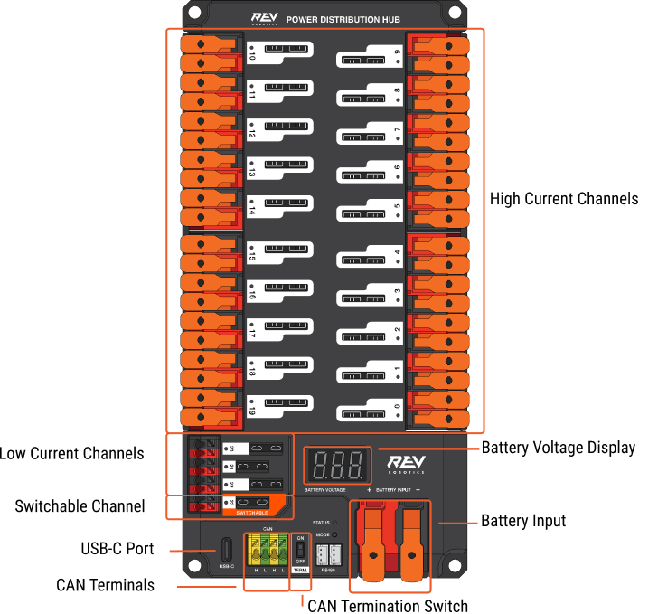

# REV Power Distribution Hub

<figure><figcaption></figcaption></figure>

### REV Power Distribution Hub (PDH)

REV Power Distribution Hub (PDH), FRC robotlarında 12VDC bataryadan çeşitli robot bileşenlerine güç dağıtımını sağlamak için tasarlanmış bir cihazdır. Bu hub, robotun elektrik sistemini daha verimli ve güvenli bir şekilde yönetmeyi amaçlar.

#### **Temel Özellikler**

* **Yüksek Akım Kanalları:** PDH, toplamda 20 adet yüksek akım kanalı sunar. Bu kanalların her biri, maksimum 40A akım taşıma kapasitesine sahiptir. Yüksek güç gereksinimi olan motorlar ve diğer bileşenler için idealdir.
  * **Sigorta Seçenekleri:** Kullanıcılar, bu kanallarda sadece **REV sigortalarını** kullanarak 40A, 30A ve 20A sigortalar takabilirler. Bu esneklik, farklı akım gereksinimlerine sahip bileşenlerin güvenli bir şekilde çalışmasını sağlar.
* **Düşük Akım Kanalları:** 3 adet düşük akım kanalı mevcuttur. Bu kanalların her biri, maksimum 15A akım taşıyabilir ve daha az enerji tüketen sensörler gibi bileşenler için uygundur.
* **Açılabilir Düşük Akım Kanalı:** 1 adet açılabilir düşük akım kanalı, gerektiğinde açılıp kapatılabilen bir güç kaynağı sağlar.

#### **Bağlantı Noktaları**

* **WAGO Terminalleri:** Alet gerektirmeyen WAGO terminalleri, hızlı ve kolay bağlantı imkanı sağlar. Kullanıcıların kabloları bağlaması veya değiştirmesi gerektiğinde, herhangi bir alet kullanmalarına gerek kalmaz.
* **LED Voltaj Göstergesi:** Hub üzerinde bulunan LED voltaj göstergesi, sistemin anlık voltaj durumunu gösterir. Bu özellik, robotun elektrik sisteminin sağlığını izlemek için faydalıdır.
* **Bağlantı Seçenekleri:** PDH, gerçek zamanlı telemetri için REV Hardware Client ile bağlantı kurma yeteneğine sahiptir. Kullanıcılar, cihazı CAN veya USB-C üzerinden bağlayarak, sistem durumunu izleyebilir.
* **Voltage Regulator Module (VRM) Bağlantı Noktaları:** PDH üzerinde, ekstra voltaj regülasyonu sağlamak için VRM bağlantı noktaları bulunur. Bu bağlantılar, daha hassas bileşenler için sabit ve güvenilir voltaj sağlar.

#### **REV Power Distribution Hub** (PDH) **Kanal Yapısı**

REV Power Distribution Hub, toplamda 20 adet yüksek akım kanalı ve 3 adet düşük akım kanalı ile birlikte 1 adet açılabilir düşük akım kanalı sunar. Kanal dağılımı aşağıdaki gibidir:

* **20 adet 40A kanalı:** Yüksek güç gereksinimi olan motorlar ve cihazlar için tasarlanmıştır.
* **3 adet 15A kanalı:** Daha düşük akım gereksinimi olan sensörler ve diğer bileşenler için uygundur.
* **1 adet açılabilir düşük akım kanalı:** Bu kanal, gerektiğinde açılıp kapatılabilen bir güç kaynağı sağlar.



