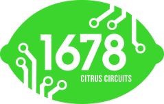
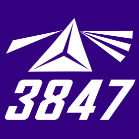

# 🤖 Teşekkürler

## **Destekleyen Takımlara Teşekkür**

Bu projede yer alan tüm destekleyen takımlara içten teşekkürlerimizi sunuyoruz. Sizin katkılarınız ve desteğiniz, projemizin başarısında önemli bir rol oynamaktadır. Elektrik, yazılım ve mekanik alanlarında sağladığınız bilgi ve deneyimler, yeni ekiplerin öğrenme süreçlerine ışık tutmakta ve onları motive etmektedir. Birlikte daha güçlü bir topluluk oluşturuyoruz.

**Teşekkürler!**

***

### Team 254 - [The Cheesy Poofs](https://www.team254.com/)

<figure><figcaption></figcaption></figure>

### Team 1678 - [Citrus Circuits](https://www.citruscircuits.org/)

<figure><figcaption></figcaption></figure>

### Team 3847 - [Spectrum](https://www.spectrum3847.org/)

<figure><figcaption></figcaption></figure>

