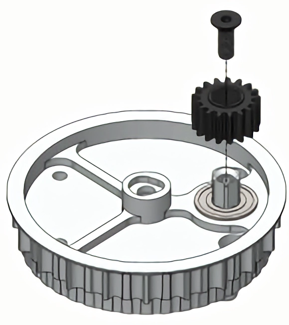

# MK4i Montaj Kılavuzu

## Adım 1 - Ana Rulman Montajı

* Beş adet #10-32 X .25 Düğme Başlı Vida ile sabitleyin. Açık olmayan vida konumları bitişik delikli noktalarla gösterilmiştir.

<figure><figcaption></figcaption></figure>

***

## Adım 2 - Tekerlek Montajı

[MK4i](./) Modülü, SDS'nin 4 “D X 1.5 ”W Kütük Tekerleğini kullanır. Lastik önceden takılmış olarak gelir.&#x20;

* 45t Konik Dişliyi altı adet #10-32 X .75 Düğme ile monte edin.
* Baş Vidaları. 45t Konik Tarafına .5” ID Rulman ve Tekerlek Ara Parçasını yerleştirin
* .375” ID Rulmanı karşı tarafa yerleştirin.

<figure><figcaption></figcaption></figure>

***

## Adım 3 - Ara Mil Montajı

### Rulmanı Takın

#### V1/V2 Ara Şaft için

FR6ZZ-10.25mmID Flanşlı Rulman ve Mil Takın

#### V3 Ara Şaft için

6802ZZ Rulmanı (flanşlı değil) ve Mili Takın

<figure><figcaption></figcaption></figure>

### Güvenli Mil ve 20DP .375 Altıgen Delikli Dişli

#### V1 Ara Şaft için

12-24 X .5” Düz Başlı Vidayı Takın

<figure><figcaption></figcaption></figure>

#### V2/V3 Ara Şaft için

Segman'ı Şaftın oluğuna takın

<figure><figcaption></figcaption></figure>

***

## Adım 4: Orta Kolon Montajı

* Kodlayıcı mıknatısını (kodlayıcı ile birlikte ayrıca verilir) Merkeze yerleştirin Sütununa yerleştirin ve Loctite 609 Tespit Bileşeni ile sabitleyin (fazlalıkları silin), mıknatısın Orta Sütunun üst kısmıyla aynı hizada olmasını sağlayın.&#x20;
* İki adet 6802ZZ Rulmanı Çift Dişliye yerleştirin ve Orta Kolon ve 1/4“-20 X.625” Soket Başlı Başlık Vidası ile yakalayın.

<figure><figcaption></figcaption></figure>

***

## Adım 5: Kasnak Montajı

* Direksiyon Kayışını Direksiyon Mili ve Taban Kasnağı arasında yakalayın.&#x20;
* .375” Altıgen delikli 20DP 50t dişliyi Direksiyon Miline ve Taban Kasnağı ile Çift Dişli arasına yerleştirin.&#x20;
* Montaja devam etmeden önce R188ZZ Rulmanı Ana Plakaya yerleştirin.

<figure><figcaption></figcaption></figure>

***

## Adım 5: Kasnak Montajı (Devam)

* Taban Kasnağı Tertibatını yerleştirin, Taban Kasnağını X-Contact Yatağı ve Direksiyon Milini R188ZZ Yatağı ile hizalayın.&#x20;
* 15t Konik Dişliyi, ardından 1mm Şimi ve 688 Yatağı yerleştirin.

<figure><figcaption></figcaption></figure>

***

## Adım 6: Tekerlek ve Motor Montaj Hazırlığı

* Tekerlek Bağlantısı B'yi iki adet 1/4-20 X .625 Soket Başlıklı Vida ile takın.&#x20;
* Üç adet 688 Rulman, 20DP 50t Dişli, .5 “OD .375 ”ID Ara Parça ve 6802ZZ Rulmanı ilgili şaftlara yerleştirin.

<figure><figcaption></figcaption></figure>

***

## Adım 7: Motor Plakası Montajı

* Üç yatak deliğini hizalayın ve Motor Plakasını takın.&#x20;
* Üç rulmanın da rulman deliklerine oturduğundan emin olun ve üç #10 X 1,875“ Ara Parçadan geçen üç #10-32 X 2,25” vida ile sabitleyin.

<figure><figcaption></figcaption></figure>

***

## Adım 8: Motor Konfigürasyonları

### Falcon 500 Motor:

* [Falcon 500](../../motorlar/fircasiz-motorlar/falcon-500.md) motorlarla birlikte verilen asetal ara parçaları kullanın.
* **Tahrik Motoru:** Pinyondan önce .125“ ve .25” ara parçalar, 20DP 14t Pinyon, .25“ ve .0625” sonra. 8-32 X 1/2” makas başlı vida ile sabitleyin.&#x20;
* **Direksiyon Motoru:** 20DP 14t Pinyon, 2 X .25“, .125”, .0625” ara parçalar sonra. 8-32 X 1/2” makas başlı vida ile sabitleyin.
* Tespit vidası üzerine orta güçte tespit macunu ile birleştirin.

<figure><figcaption></figcaption></figure>

### [NEO](../../motorlar/fircasiz-motorlar/neo-v1/) ve [NEO Vortex](../../motorlar/fircasiz-motorlar/neo-v1/neo-vortex.md) Motorlar (8mm anahtarlı mil):

* **Tahrik Motoru:** Pinyondan önce .437” ara parça, 20DP 14t Pinyon, sonra tutma halkası.&#x20;
* **Direksiyon Motoru:** Pinyondan önce 1 mm ara parça, 20DP 14t Pinyon, sonra tespit halkası.&#x20;
* Ara parçaları [NEO](../../motorlar/fircasiz-motorlar/neo-v1/) Motor şaftlarına yerleştirin, ardından makine anahtarlarını, dişlileri ve tespit halkalarını takın.

<figure><figcaption></figcaption></figure>

### [Kraken X60](../../motorlar/fircasiz-motorlar/kraken-x60.md) Motorları:

**Tahrik Motoru:** Önce .125“ ara parçayı, ardından 20DP 14t Pinyonu ve en son .375” ara parçayı takın. Orta güçte tutucu bileşik kullanarak 10-32 X 1/2” Düğme Başlı Vida ile sabitleyin.&#x20;

**Direksiyon Motoru:** Önce 20DP 14t Pinyon Dişlisini, sonra .125“ ara parçayı ve en son .375” ara parçayı takın. 10-32 X 1/2” Düğme Başlı Vida ile orta güçte tutucu bileşik kullanarak sabitleyin.


ÖNEMLİ: Motorlar ve Ana Plaka arasında bir parazit oluşmasını önlemek için soğutma portu vidalarını motorlardan çıkarın ve ardından portları bantla kapatın.


***

## Adım 9: Motor Montajı

* [Falcon 500](../../motorlar/fircasiz-motorlar/falcon-500.md) Motorlarını dört adet #10-32 X 1,5“ vida ve #10 X 1,125” ara parça ile takın.&#x20;
* [NEO](../../motorlar/fircasiz-motorlar/neo-v1/), [NEO Vortex](../../motorlar/fircasiz-motorlar/neo-v1/neo-vortex.md) ve [Kraken X60](../../motorlar/fircasiz-motorlar/kraken-x60.md) Motorlar için üç vida/ara parçası kullanın. [NEO Vortex](../../motorlar/fircasiz-motorlar/neo-v1/neo-vortex.md) ve [Kraken X60](../../motorlar/fircasiz-motorlar/kraken-x60.md) Motorlar için, her motor ve üç ara parça arasına bir Yarım Daire Ara Parçası takın (gösterilmemiştir).

<figure><figcaption></figcaption></figure>

***

## Adım 10: Tekerlek Montajı

* Omuz Cıvatasını, entegre ara parçası tekerleğe bakacak şekilde kısmen Tekerlek Bağlantısı A'ya yerleştirin.&#x20;
* Tekerlek alt montaj modülünü kaydırın ve Omuz Cıvatasını kısmen vidalayın.&#x20;
* Tekerlek Bağlantısı A'yı iki adet 1/4-20 X 1” Soket Başlı Vidayla sabitleyin. Omuz Cıvatasını vidalayın.

<figure><figcaption></figcaption></figure>

***

## Adım 11: Enkoder Montajı

* Enkoder devre kartını takmadan önce (SRX Mag Enkoder kullanıyorsanız veri kablosunu takarak veya CANcoder kullanıyorsanız CAN kablolarını lehimleyerek) enkoder ile birlikte verilen her iki #3 - 48 vida ile (diş kilitleme bileşeni olmadan) gövde tabanını monte ederek başlayın.&#x20;
* Tercih ettiğiniz kablo yönü ile sonuçlanan montaj deliklerini seçin. Muhafaza kapağını yerleştirin ve CTR Electronics talimatlarını izleyin


“2-28 VIDAYI AŞIRI SIKMAYIN, AKSI TAKDIRDE MUHAFAZADA KALICI HASAR MEYDANA GELEBILIR. DIRENÇ HISSEDILENE KADAR ELLE SIKIN.”&#x20;


* İşlenmiş tutucu özelliklerini kullanarak enkoder kablolarını Motor Plakasına bağlayın.&#x20;
* Son olarak, sağlanan üç adet 8-32 X .875“ Düğme Vidayı ve üç adet #8 X .531” Ara Parçayı kullanarak işlenmiş Enkoder Muhafazasını monte edin.

<figure><figcaption></figcaption></figure>

***

## Adım 12: Modül Montajı

* Son #10 X 1,875“ ara parçayı #10-32 X 2,25” Soket Başlı Vida ile modüle takın.&#x20;
* Kutu borusuna sağlanan altı adet 2,5” Soket Başlı Başlık Vidası (saptırma modülü yapılandırmasına bağlı olarak #8-32 veya #10-32) ile monte edin.


ÖNEMLİ: Dişlileri kullanmadan önce beyaz lityum veya Red “N” Tacky gres ile ve kullanım sırasında düzenli olarak yağlayın.


<figure><figcaption></figcaption></figure>

